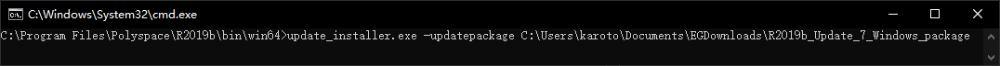
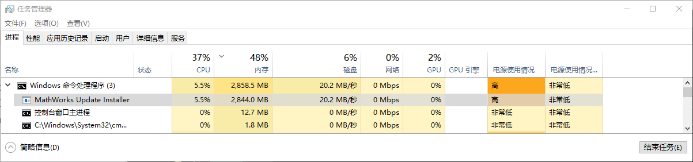

# Learn_Simulink_STM32

管理员身份运行  

下载离线更新: `https://www.mathworks.com/downloads/web_downloads/download_update_installers/R2019b%20Update%207`

安装更新, windows的cmd窗口 切换到 `C:\Program Files\Polyspace\R2019b\bin\win64>` 路径, 运行:  

`update_installer.exe -updatepackage C:\EGDownloads\R2019b_Update_7_Windows_package`  

  

弹出窗口确认后啥也没有, 用任务管理器监视, 进程消失才表示安装完成:  

  

安装完成后需要重新复制 license_standalone.lic 和 替换libmwlmgrimpl.dll 到目录 `C:\Program Files\Polyspace\R2019b\bin\win64\matlab_startup_plugins\lmgrimpl`  

管理员身份运行Matlab, 输入 `pathtool`

None

时基从systick改为TIM1

优化编译速度

keil设置自动更新编译? 不弹窗?

输入输出不变, 调用就不变?

确保目录正确

solver 0.01 => 10ms

keil .pack安装
Cube 配置

可以装多个版本的Matlab, 不冲突  