# Simulink_STM32_GPIO

<!-- TOC -->

- [Simulink_STM32_GPIO](#simulink_stm32_gpio)
  - [工作流程](#工作流程)
  - [STM32CubeMX操作](#stm32cubemx操作)
  - [Keil配置](#keil配置)
  - [Matlab/Simulink操作](#matlabsimulink操作)

<!-- /TOC -->

## 工作流程

先简要介绍下流程:  

- 先用 `STM32CubeMX` 进行时钟, 外设等的初始化配置, 设置好工程的路径和选用的IDE, 保存是一个`.ioc`文件
- Simulink 新建模型`.slx文件`, 配置`stm32.tlc`, 固定步长(Fixed-step size), 加载上面的`.ioc`文件, 模型开发, `Ctrl+B`生成代码(会调用STM32CubeMX)
- 用Keil或者STM32CubeIDE打开生成的工程:
  - `main.c`中加入Matlab自动生成的代码的头文件(`slx同名.h`)  
  - `main.c`初始化部分加入 systick定时器配置 和 `slx同名_initialize()` 函数  
  - `main.c`的while或者systick定时器中断中加入 `slx同名_step()函数`, 被调用的周期就是上面设置的固定步长(Fixed-step size), 0.01表示每10ms调用step函数.
  - 上面几步只需第一次设置, 后面无需配置
  - Keil或者STM32CubeIDE的编译下载运行, 或许可以设置上面的Ctrl+B一条龙下载

下面以点灯和按键为例介绍.  

NUCLEO-F767ZI 有 3个用户LED 和 1个按键, 引脚对应关系如下:  

|Name| PIN |
|--|--|
| LED1 (Green, LD1) | PB0(1点亮) |
| LED2 (Blue, LD2) | PB7(1点亮) |
| LED3 (Red, LD3) | PB14(1点亮) |
| BTN1 (User Button, B1) | PC13(默认0, 按下1) |  

## STM32CubeMX操作

打开STM32CubeMX, 通用一些, 这里不从板子创建, 选择MCU创建.  点击 `ACCESS TO MCU SELECTOR`:  


输入STM32F767ZI, 双击:  


先配置调试下载端口为两根线的SWD方式, 如果不配置下载端口的话, 有可能会出现个别MCU只能下载一次的情况, 虽然可以救回来, 稍微复杂些罢了, 索性每次都配好没有后顾之忧, 可以看到PA13和PA14变绿. Timebase Source改成TIM6, 因为默认的Systick要给生成的代码定时调用:  

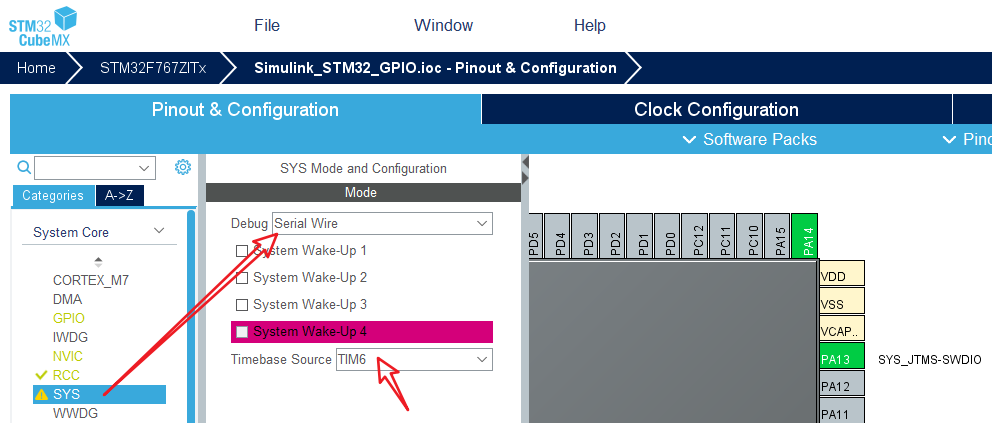

RCC设置, 选择HSE(外部高速时钟)为Crystal/Ceramic Resonator(晶振/陶瓷谐振器), 一般外部有晶振的这么配就可以, NUCLEO-F767ZI的时钟是ST-LINK的MCO直接过来的8M时钟, 这么配也能工作:  


直接在图上找到PB0, 单击, 弹出的菜单中选择GPIO_Output:  


同样的方式, 配置另外两个LED的引脚为GPIO_Output, 配置按键的引脚为GPIO_Input.  

可以引脚PB0上右击, 点击Enter User Label, 输入用户标签LED1, 也可以点击GPIO进行配置:  


可以看到可以配置初始的输出电平是高还是低, GPIO模式这里默认推挽输出, 不上拉也不下拉, 最大输出速率低即可, 这里的`User Label`为LED1, 同样的方式命名PB7为LED2, PB14为LED3, PC13为BTN1, 当然不命名也无所谓.  

接下来是时钟树的配置, 外部8M时钟, 所以选择`HSE`, `Input frequency`输入`8`, 选上必经之路`PLLCLK`, 然后`HCLK`中提示`216MHz max`, 那就敲入216, 打个回车, 会发现整个时钟树自己就开始自动配置了(最好联网), 很方便:  


Project Manager -> Project里面填入工程名, 选择工程位置, IDE选MDK-ARM:  

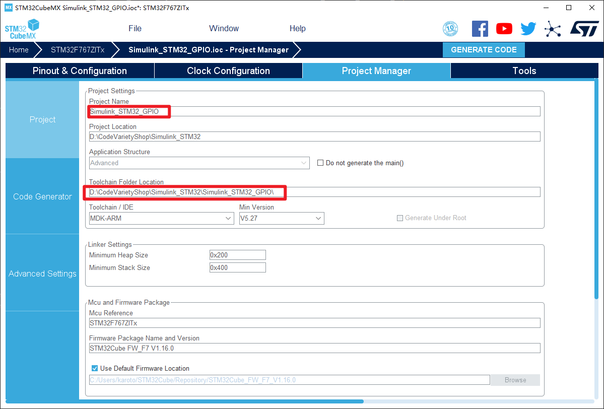

Code Generator里面勾选`Copy only the necessary library files`, `Generate peripheral initialization as a pair of .c/.h files per periphral`:  


点击上图中右上角的`GENERATE CODE`, 弹出如下窗口, 选择打开工程, 就可以看到keil工程自动打开了:  


## Keil配置

Keil配置Debug为ST-link, 并设置下载后自动复位运行, 勾选`Flash Download`->`Reset anD Run`并且去掉勾选`Pack`->`Enable`:  

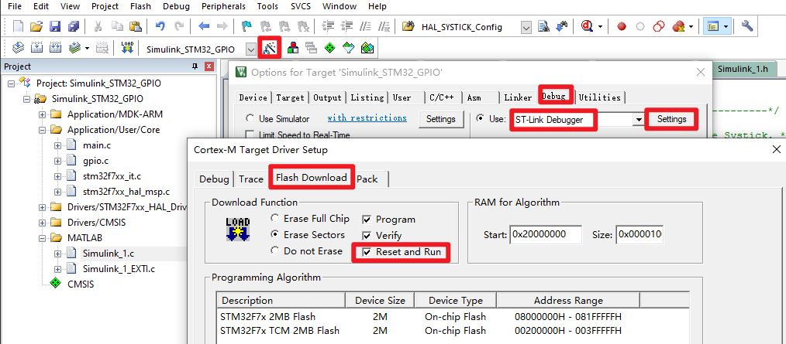

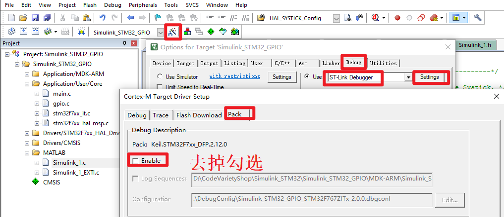

如果工程较大, 嫌编译速度过慢, 可以去掉Output中的这三个勾选, 或者仅保留Browse Information(用于F12跳转定义)的勾选:  


这样, 重新编译会快很多.  

编译和下载按钮如下:  

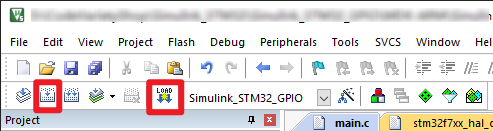

## Matlab/Simulink操作

打开Matlab, 切换到上面`STM32CubeMX的.ioc文件`所在的目录, 这很重要:  

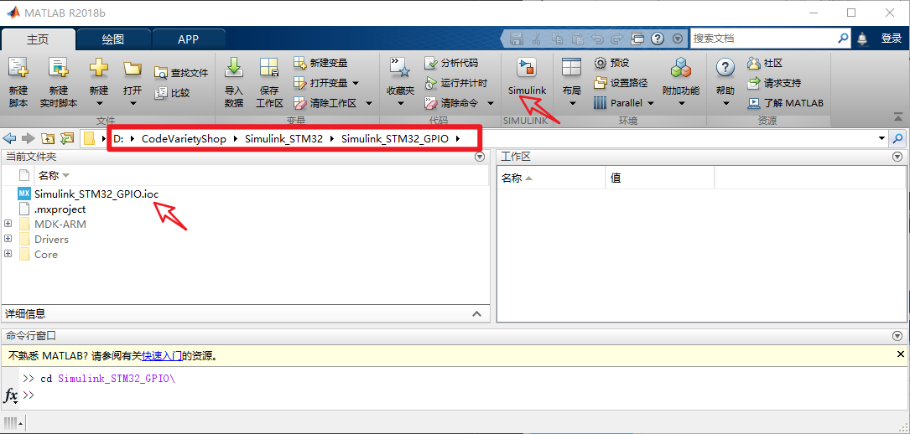

点击`Simulink`按钮, 新建空模型:  

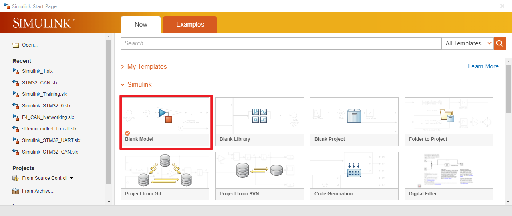

Ctrl+S保存到`.ioc`文件所在的同一目录(也是Matlab当前工作目录), 随便命名为`Simulink_1.slx`.  

点击`Model Configuration Parameters`按钮 -> Code Generation -> Browser -> 选择 `stm32.tlc`, Apply, OK:  

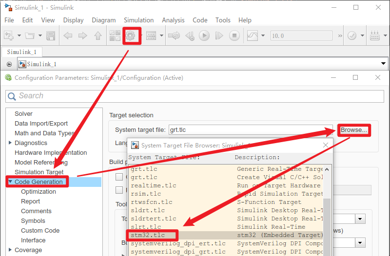

Code Generation -> Interface -> Code replacement library, 可以把默认的`ARM CMSIS SIN COS`改为`None`:  

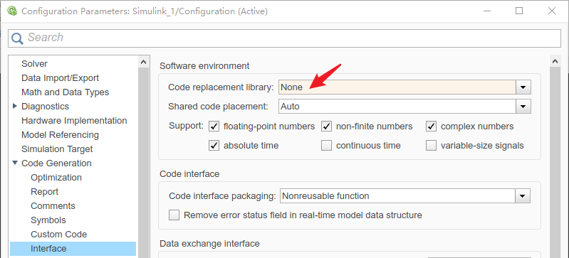  

Code Generation -> STM32 Options:  

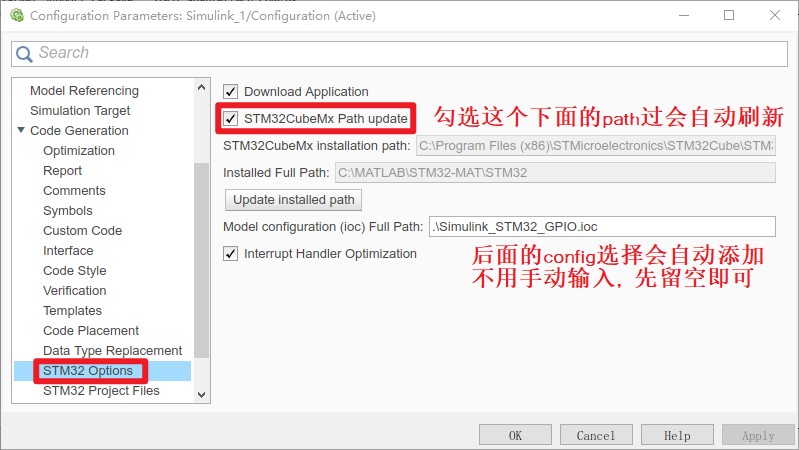

Code Generation -> STM32 Project Files, 勾选Relative..., 后面操作UART或者CAN的时候, 需要包含的.c或者.h文件也可以在这里加进去:  

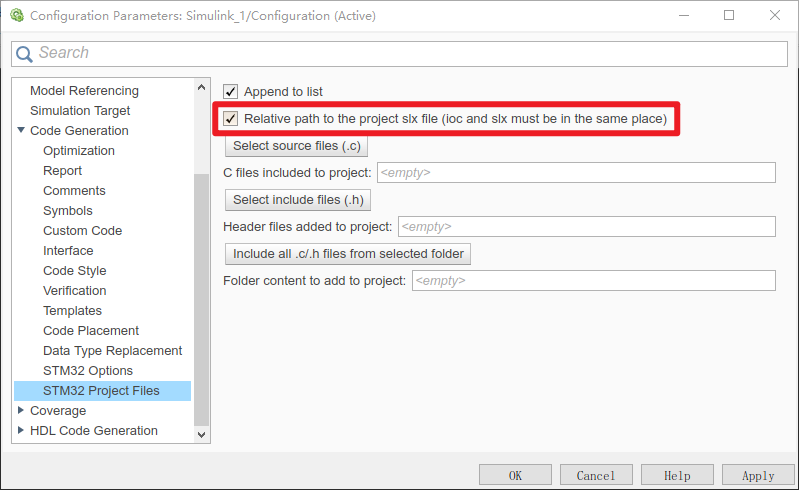

移到最上面的 Solver -> Solver details, Fixed-step size由auto改为`0.01`:  

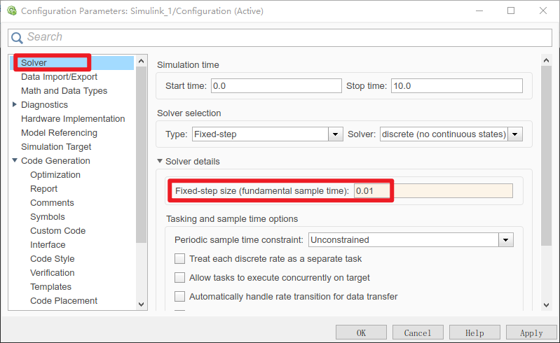

这个0.01代表0.01s, STM32的Systick定时器(不改默认1ms)就要设置10ms中断, 每10ms调用一次自动生成的step函数. 整个模型运行一次的时间不应超过这个10ms限制, 否则要改大这个参数. Apply, OK.  

点击Library Browser按钮 -> Target Support Package - STM32 Adapter -> MCU CONFIG, 把STM32_Config模块拖入模型中:  

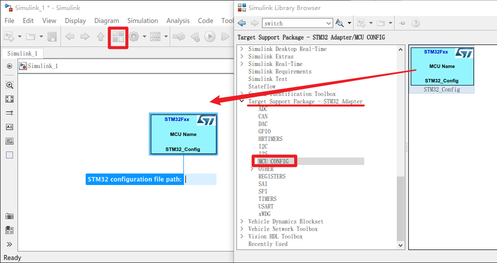

双击STM32_Config, 点击Select STM32 configuration file按钮, 选择.ioc文件, 此时模型中自动识别出STM32F7678ZITx, OK:  

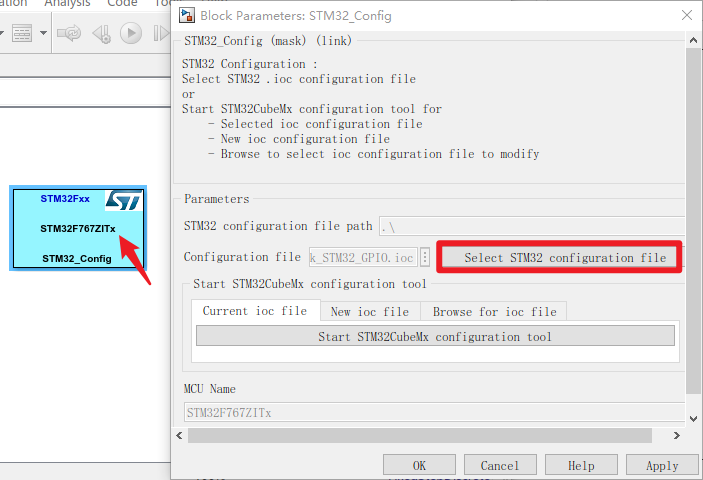

GPIO中拖入GPIO_Read, 双击设置, 只有GPIOC, Pin13能勾选, 这是上面.ioc中的设置:  

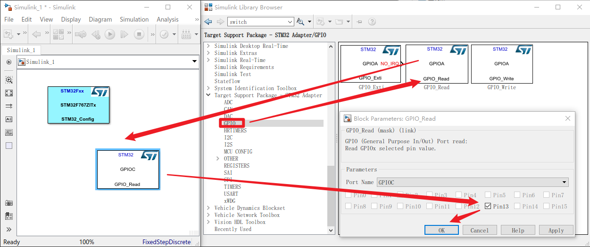

GPIO中拖入GPIO_Write, 弹出:  

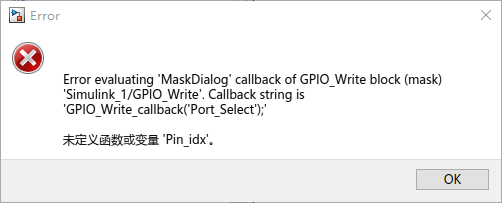

[simulink自动生成STM32代码详解](https://blog.csdn.net/qq_39751352/article/details/105860577)也提到了, 先不管, x掉, 双击GPIO_Write设置, 只有GPIOB的Pin0, Pin7, Pin14可以勾选, 都勾上:  

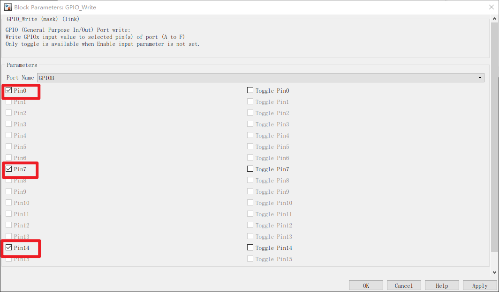

单击鼠标把两个模块连起来:  

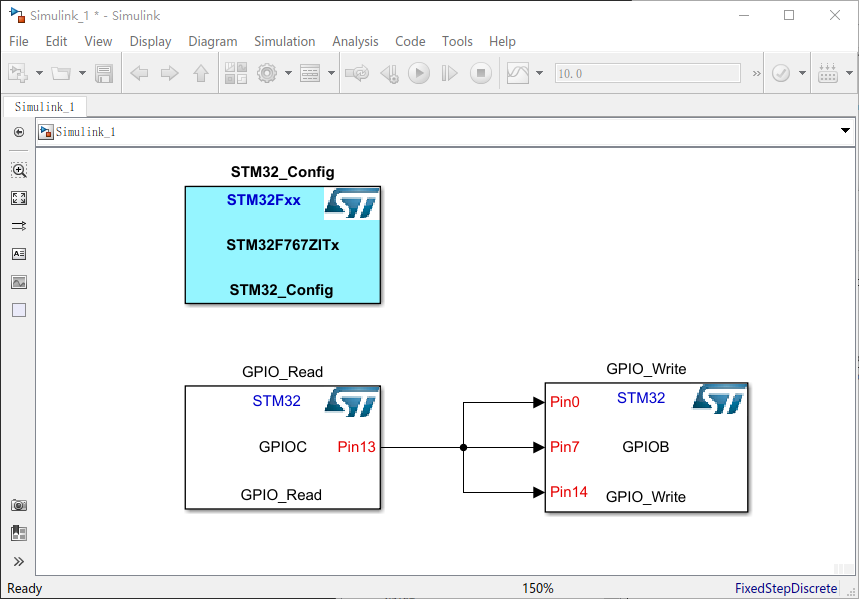

由于PC13按键默认低电平, 按下高电平, LED默认熄灭, 高电平电量, 所以, 这个模型表示按下按键3个LED同时亮, 松开按键LED熄灭.  

Ctrl+B 或者 点击Build Model 按钮:  

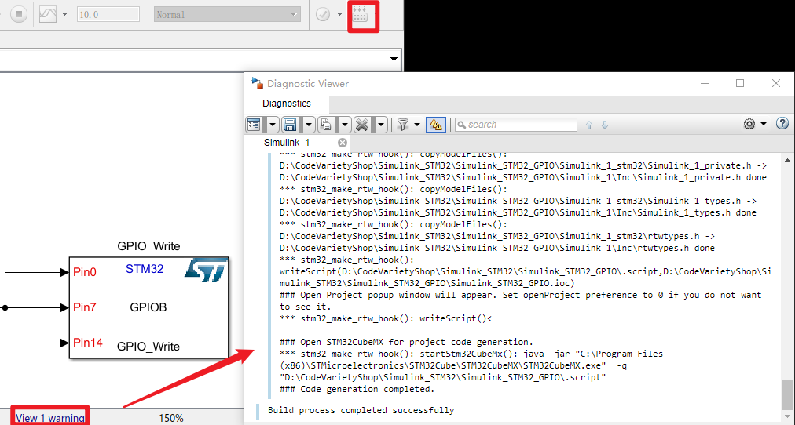

这样代码就生成了, 手动去MDK-ARM打开Keil文件, 或者已经打开keil会提示Reload, 选择是:  

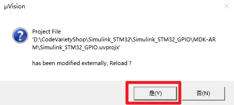

可以看到Matlab/Simulink生成的相关文件已经被加入了工程:  

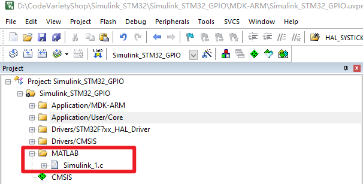

main.c中, `/* USER CODE BEGIN Includes */`和`/* USER CODE END Includes */`加入`#include "Simulink_1.h"`, 不要在其他地方乱加, 不然下次生成可能会被覆盖:  

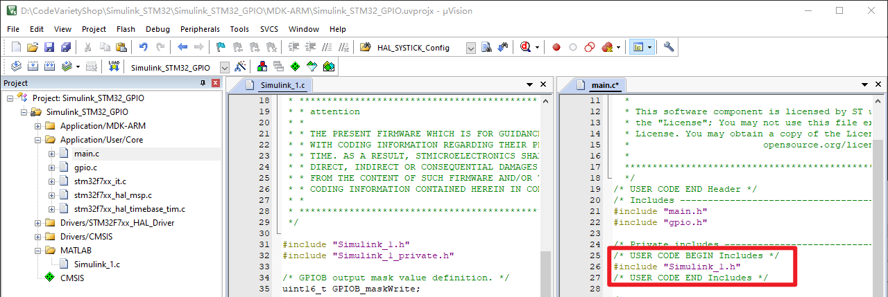

main.c中, `/* USER CODE BEGIN 2 */`和`/* USER CODE END 2 */`之间设置Systick 100Hz, 模型初始化:  

```c
  /* USER CODE BEGIN 2 */
	HAL_SYSTICK_Config(SystemCoreClock / 100.0);
	Simulink_1_initialize();
  /* USER CODE END 2 */
```

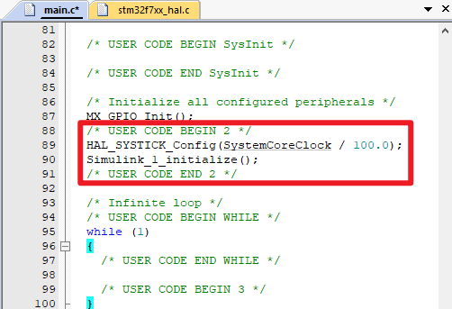

打开`stm32f7xx_it.c`, `/* USER CODE BEGIN Includes */`和`/* USER CODE END Includes */`之间加入 `#include "Simulink_1.h"`:  

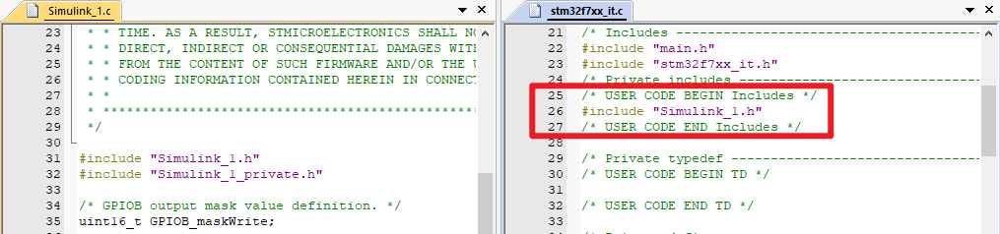  

`stm32f7xx_it.c`的`void SysTick_Handler(void)`中断处理函数, `/* USER CODE BEGIN SysTick_IRQn 1 */`和`/* USER CODE END SysTick_IRQn 1 */`中加入`Simulink_1_step();`, 在这里它将每10ms调用一次:  

```c
void SysTick_Handler(void)
{
  /* USER CODE BEGIN SysTick_IRQn 0 */

  /* USER CODE END SysTick_IRQn 0 */

  /* USER CODE BEGIN SysTick_IRQn 1 */
	Simulink_1_step();
  /* USER CODE END SysTick_IRQn 1 */
}
```

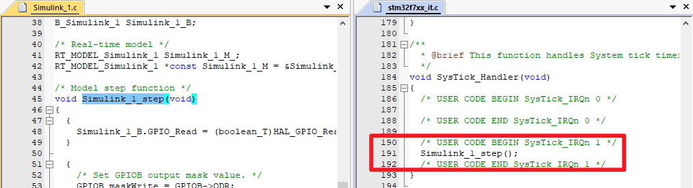  

编译, 下载:  


按下按键, 灯亮, 松开按键, 灯灭, 符合预期.  
