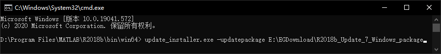
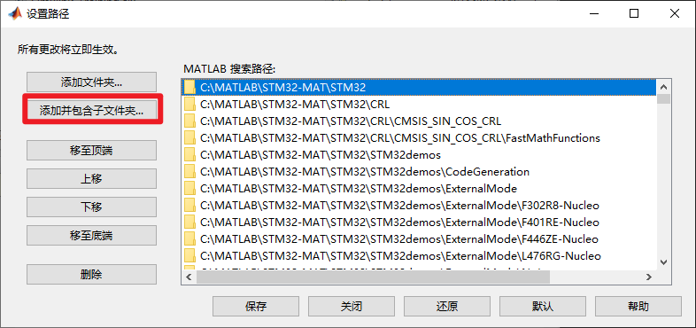

# 环境搭建

<!-- TOC -->

- [环境搭建](#环境搭建)
  - [前言](#前言)
  - [官方简介](#官方简介)
  - [Matlab R2018b安装](#matlab-r2018b安装)
  - [STM32-MAT/TARGET 安装](#stm32-mattarget-安装)
  - [STM32CubeMX 安装](#stm32cubemx-安装)
  - [STM32CubeIDE, Keil安装](#stm32cubeide-keil安装)
  - [ST-Link驱动安装](#st-link驱动安装)

<!-- /TOC -->

## 前言

基于模型的开发与直接用HAL, C撸STM32代码并不冲突, 各有各的优势, 互补才是王道.  

## 官方简介

参考 [Code generation for STM32 MCUs using MATLAB® and simulink®](https://my.st.com/resource/en/product_presentation/stm32-matlab.pdf)

必须安装的软件:  

- Matlab R2018b
- STM32CubeMX 5.6.0
- STM32-MAT/TARGET, 5.6.0, 这个是工具包(toolkit)
- STM32CubeIDE 1.3.0 或 Keil 5.29.0 或 IAR 8.32.3, 选一个工具链(Toolchain)就可以

硬件:  

- STM32的板子
- ST-Link V2/V3, 或者第三方调试工具

有了这些, 就可以为STM32 MCU启用基于模型的设计工作(Model-Based Design Workflow):  

- 创建可执行模型
- 自动生成代码
- 自动化软件集成

文档估计:  

- ECU开发成本和时间减少了约33%
- 规格错误减少了约50%

STM32为什么使用Matlab/Simulink:  

- 创建数学算法时可能需要进行仿真
- Matlab / Simulink 支持STM32仿真和片上算法执行
- 该算法可以使用实际的STM32外设, 最终在MCU中完成了100% 的完整处理, 无需编写任何代码, 完整的模型驱动方法使错误率更低  

工具快速说明:  

使用情景与工具:  

## Matlab R2018b安装

Matlab R2018b如果从官网下载最新版，补丁应该是打全了的，如果是从网盘之类下载的, 最好打一下补丁, 补丁下载: [Matlab R2018b Update Package for Offline Installation](https://www.mathworks.com/downloads/web_downloads/download_update_installers/R2018b%20Update%207), 用下载工具如EagleGet之类的能达到3M/s还是很快的:  

安装步骤:  

- 先安装Matlab R2018b, 此处略
- 安装补丁包: windows的cmd窗口切换到Matlab安装路径, 以`D:\Program Files\MATLAB\R2018b\bin\win64`为例, 运行 `update_installer.exe -updatepackage E:\EGDownload\R2018b_Update_7_Windows_package`, 后面的是补丁解压后的路径:   
- 激活

注意安装补丁包的时候, 弹出窗口确认后啥也没有, 用任务管理器监视, 进程消失才表示安装完成:  

  

## STM32-MAT/TARGET 安装

STM32-MAT/TARGET 主要特性:  

- 用于STM32微控制器的Simulink应用程序配置
- STM32配置通过STM32CubeMX完成
- STM32的自动“ C”代码生成基于STM32Cube HAL库
- 使用USART RTioStream的处理器循环(PIL, Processor In the Loop)
- 报告：代码生成, 代码执行分析
- STM32外设Simulink库模型

[STM32-MAT/TARGET 下载](https://www.st.com/en/development-tools/stm32-mat-target.html), 最新版本5.6.0, 需注册ST账号.  

默认的安装路径是 `C:\MATLAB\STM32-MAT\STM32`, 需要把这个文件夹及子文件夹的内容加到Matlab路径中. 打开Matlab, 输入`pathtool`, 点击`添加并包含子文件夹`按钮, 找到这个路径加进去:  

该路径下还有`STM32_MAT-TARGET_HandsOn.pdf`和`Readme.html`, 是第一手参考资料了.  

## STM32CubeMX 安装

官方推荐的5.6.0版本, 可以安装官方的来, 这里我直接装了最新的6.0.1, [STM32CubeMX下载](https://www.st.com/en/development-tools/stm32cubemx.html), 需要注册ST账号.  

安装完成后, 打开, 还要安装器件的软件包: Help -> Manage embedded software package, 用哪个单片机装哪个, 也可以把常用的F1, F4, F7, H7的都装上, 展开, 勾选, `Install Now`:  

  

## STM32CubeIDE, Keil安装

[STM32CubeIDE](https://www.st.com/en/development-tools/stm32cubeide.html), ST官方推出的Eclipse风格的IDE, 免费, 足够用, 推荐.  

[Keil MDK](http://www2.keil.com/mdk5/), ARM官方推的工具, 用的人太多了, 下载安装激活就不介绍了, 安装完后, 也要安装单片机对应的pack包, 可以在keil中装, 也可以下载.pack文件如`Keil.STM32F4xx_DFP.2.15.0.pack`双击安装.  外网下载困难的话, 用[安富莱的这个下载](https://zhuanlan.zhihu.com/p/262507061)  

## ST-Link驱动安装

调试下载用的ST-Link, 插到联网的Win10应该会自动安装驱动, 没有也不要担心, 设备管理器右键本地找驱动, 驱动就在Keil的安装目录下, 如我的: `C:\Keil_v5\ARM\STLink\USBDriver`. 也可以这里下载 [ST-LINK Driver](https://www.st.com/en/development-tools/stsw-link009.html).  

插上ST-Link, 驱动安装完成后, 可以右键Win图标->设备管理器, 应能看到:  

